::right::

<div class="flex flex-col justify-center items-start text-left h-full">

# The Agentic Era for Dummies

### <i>Dennis Yeo</i>
### <i>CPO, Tradesocio</i>

</div>

<!--
AI in the Workplace Panel
June 2026
A Builder's Guide for Managers & Professionals
-->

---
layout: default
---

# 01a. How we got here

<div class="grid grid-cols-4 gap-4 mt-8">

<div class="bg-[#0B0F19] p-5 rounded-lg border border-slate-800 flex flex-col justify-between h-84">
<div>
<span class="font-mono text-xs text-slate-500 block mb-2">LATE 2022 - 2023</span>
<h3 class="text-lg font-bold text-white mb-3">Manual prompting</h3>
<p class="text-xs text-slate-400 leading-relaxed">Transformer-based Large Language Models (LLMs) burst onto the scene. Everyone manually copy-pasted into ChatGPT's webpage and did <b>"prompt engineering"</b>.</p>
</div>
<div class="text-xs font-mono text-slate-600">Phase 01 // <br>Manual Input</div>
</div>

<div class="bg-[#0B0F19] p-5 rounded-lg border border-slate-800 flex flex-col justify-between h-96">
<div>
<span class="font-mono text-xs text-slate-500 block mb-2">2023 - 2024</span>
<h3 class="text-lg font-bold text-white mb-3">Grounding & RAG</h3>
<p class="text-xs text-slate-400 leading-relaxed">AI didn't have the organization's context. Enter <b>RAG</b>: searching for useful info on-demand and putting it into prompts using vector databases / semantic search and dynamic corporate data injection.</p>
</div>
<div class="text-xs font-mono text-slate-600">Phase 02 // Automatic <br>Context Injection</div>
</div>

<div class="bg-[#0B0F19] p-5 rounded-lg border border-slate-800 flex flex-col justify-between h-90">
<div>
<span class="font-mono text-xs text-slate-500 block mb-2">2024 - 2025</span>
<h3 class="text-lg font-bold text-white mb-3">Tool-calling</h3>
<p class="text-xs text-slate-400 leading-relaxed">AI began being used to <b>decide and execute actions</b>. LLMs were made to output in structured formats, allowing them to be used to call tools/APIs and query databases.</p>
</div>
<div class="text-xs font-mono text-slate-600">Phase 03 // Tool Use</div>
</div>

<div class="bg-[#0B0F19] p-5 rounded-lg border-2 border-sky-500 shadow-[0_0_20px_rgba(14,165,233,0.15)] flex flex-col justify-between h-96 relative overflow-hidden">
<div class="absolute top-0 right-0 bg-sky-500 text-[#070a13] font-mono text-[9px] font-bold px-2 py-0.5 uppercase tracking-wider">Current State</div>
<div>
<span class="font-mono text-xs text-sky-400 block mb-2">2025 - 2026</span>
<h3 class="text-lg font-bold text-white mb-3 bg-gradient-to-r from-white to-sky-400 bg-clip-text text-transparent">Agentic networks</h3>
<p class="text-xs text-slate-300 leading-relaxed">Networks of agents running autonomously in loops, on schedules, or triggered by events. Systems that draw on corporate resources/tools and execute complex, long-running tasks. Agents triggering other agents.</p>
</div>
<div class="text-xs font-mono text-slate-600">Phase 04 // The Agent Era</div>
</div>

</div>

<footer class="absolute bottom-2 left-0 right-0 text-center text-xs text-slate-500 font-mono">LLM EVOLUTION</footer>

<!--
Timeline progression showing the 4 phases of LLM evolution:
1. Basic prompting (2022-2023)
2. RAG and grounding (2023-2024)
3. Function calling (2024-2025)
4. Agentic loops (2025-2026) - current state highlighted
-->

---
layout: default
---

# 01b. What is a "transformer" LLM, exactly?

- Input text: `The dog ate my`
- Words -> tokens (little chunks of words)
- Token -> vector (list of numbers representing point in high-dimensional space)
  - E.g. `[0.7, 0.2, ...]`, one for every single word chunk in the text
  - A vector can capture complex ideas and even combinations of ideas
- The "thinking": all the vectors are fed into a series of layers that analyze different aspects
  - Each layer is (attention pattern -> multilayer perceptron)
- The final layer emits vectors; the very last one represents the most likely next token (word chunk) that follows after the text
  - That _single word chunk_ is the result of **all the computation across all words in the text.**
  - `The dog ate my [homework]`
- Repeat entire process using the full text + that single predicted token, generating more text (**"inference"**).
- If you make LLMs big enough, you can train them to produce pretty logical sentences.
  - Sentences like those a human might write.

---
layout: default
---

# 02a. What is an agent, exactly?

Strip away the marketing pitch, and an agent is **not** an artificial mind. It is a **deterministic software loop** that calls (uses) LLMs to get instructions on what to do until the task is done.

Agents are **empowered by connecting them to tools and data.**

```mermaid
flowchart LR
    subgraph AGENT["🤖 Agent / Orchestrator"]
        direction LR
        A["📅 Event /\nSchedule"] --> B[("Read the\nmemory store")]
        B --> C["✨ Call the LLM Gateway"]
        C --> D{"Tool call?"}
        D -->|Yes| E["🛠️ Execute tool"]
        D -->|No| F[("✍️ Update memory store \n/ databases")]
        E --> F
        F --> G{"Complete?"}
        G -->|No| C
        G -->|Yes| H["Done"]
    end
    
    style AGENT fill:#1e293b,stroke:#0ea5e9,stroke-width:2px
    style A fill:#0B0F19,stroke:#64748b
    style B fill:#0B0F19,stroke:#6366f1
    style C fill:#0B0F19,stroke:#0ea5e9
    style D fill:#0B0F19,stroke:#22c55e
    style E fill:#0B0F19,stroke:#0ea5e9
    style F fill:#0B0F19,stroke:#6366f1
    style G fill:#0B0F19,stroke:#22c55e
    style H fill:#0B0F19,stroke:#64748b
```



**Core Insight:** Every "agent" is fundamentally:
- A program **loop** running checks: *"What's the current situation / state of work?"*
- An **LLM call**: *Sends current situation to AI for it to decide what to do*
- A **tool executor**: *Execute the actions that AI decides*

An LLM is a tool the orchestrator uses, not the orchestrator itself.

---
layout: default
---

# 02b. Agents transform operations for small teams
<br>

<div class="grid grid-cols-2 gap-8 mt-4">

<div class="text-xs">

#### Real-world impact

> In risk monitoring, we don't just flag "unusual activity" for a human to review in the morning. An agent immediately pulls the user's history, cross-references recent actions, login patterns, IP addresses, etc., and prepares a summary or triggers an alert or access suspension.

<div class="mt-6">

#### Result
> Operations teams shift from heavy manual investigation to more targeted, deeper analysis, and start managing outcomes at a higher level.

</div>

</div>

<div>

<table class="w-full text-xs border-separate border-spacing-0 rounded-lg overflow-hidden">
<thead>
<tr>
<th class="w-1/2 py-2 px-4 bg-red-500/10 text-left text-red-400/80 font-semibold uppercase tracking-wider border-b border-slate-800">Traditional Approach</th>
<th class="w-1/2 py-2 px-4 bg-emerald-500/10 text-left text-emerald-400/80 font-semibold uppercase tracking-wider border-b border-slate-800">Agentic Approach</th>
</tr>
</thead>
<tbody class="divide-y divide-slate-800/50">
<tr>
<td class="py-2.5 px-4 align-top">
  <span class="font-medium text-red-400/70">Fixed Rules</span><br>
  <span class="text-slate-400">If X happens, trigger Y.</span>
</td>
<td class="py-2.5 px-4 align-top">
  <span class="font-medium text-emerald-400/70">Contextual Reasoning</span><br>
  <span class="text-slate-400">If X happens, investigate, compare with history, and decide.</span>
</td>
</tr>
<tr>
<td class="py-2.5 px-4 align-top">
  <span class="font-medium text-red-400/70">Manual Investigation</span><br>
  <span class="text-slate-400">Managers read logs to find patterns.</span>
</td>
<td class="py-2.5 px-4 align-top">
  <span class="font-medium text-emerald-400/70">Automated Synthesis</span><br>
  <span class="text-slate-400">AI synthesizes raw data into executive summaries.</span>
</td>
</tr>
<tr>
<td class="py-2.5 px-4 align-top">
  <span class="font-medium text-red-400/70">High Friction</span><br>
  <span class="text-slate-400">Human must intervene for every edge case.</span>
</td>
<td class="py-2.5 px-4 align-top">
  <span class="font-medium text-emerald-400/70">High Leverage</span><br>
  <span class="text-slate-400">Humans manage the &ldquo;exception&rdquo; while AI handles the &ldquo;routine.&rdquo;</span>
</td>
</tr>
</tbody>
</table>

</div>

</div>

---
layout: default
---

# 02c. Building agentic systems

<div class="grid grid-cols-2 gap-6 mt-4">

<div class="space-y-4">

- Small team sets up the core infrastructure
- Builds efficient agentic operations on top
- Humans check the logged results, handle unexpected scenarios, and update the agentic logic

```python
def run_agent_loop(state):
    # Autonomous execution loop pattern
    while state["status"] != "complete":
        prompt = build_context(state)
        response = query_llm_gateway(prompt)

        # Key step: Read the LLM's response
        tool_call = parse_json_schema(response)
        
        if tool_call:
            result = execute_native_tool(tool_call)
            state["history"].append(result)
        else:
            state["status"] = "complete"
    
    return state["output"]
```

</div>


<div class="space-y-4">

<div class="space-y-4 bg-[#0B0F19]/60 p-4 rounded-lg border border-slate-800/80">

#### Key governance concerns

- **Access control:** Strictly specifying which tools a model can call, to prevent unauthorized use of data/tools.
- **Data privacy:** For especially sensitive data, Trusted Execution Environments (TEEs) can be used to preserve confidentiality.
- **Auditable logging:** Every routing decision, tool execution, and raw text input is completely logged.

</div>

</div>

</div>

<!--
This pseudo-code shows the core agent loop pattern.
Key teaching point: it's fundamentally a while loop with LLM calls in the middle.
Business benefits: control, auditability, deterministic behavior
-->

---
layout: default
---

# 03a. Fintech (trading) applications

<div class="grid grid-cols-2 gap-4 mt-4">


<div class="space-y-4">
<br><br><br><br>

### Client analysis for account managers

- AI reads information of a client
- Offers insights and talking points for an account manager to use

</div>

</div>

---
layout: default
zoom: 0.7
---

# 03b. Portfolio generation 1

<div class="grid grid-cols-2 gap-4 mt-4">


<div class="space-y-4">

<br><br><br><br><br><br><br><br><br>

## Example: Portfolio generation

</div>

</div>

---
layout: default
zoom: 0.68
---

# 03c. Portfolio generation 2

<div class="grid grid-cols-2 gap-4 mt-4 place-items-center">


</div>

---
layout: default
zoom: 0.5
---

# 03d. Portfolio generation 3

<div class="grid grid-cols-2 gap-4 mt-4 place-items-center">


</div>

---
layout: default
---

# 03e. Portfolio generation 4

<div class="flex justify-center items-center">

</div>

---
layout: default
---

# 03f. Portfolio generation 5

<div class="flex justify-center items-center">

</div>

---
layout: default
---

# 04. What are those no-code 'agent builders'?

<div class="mt-4 mb-6 text-slate-300 max-w-3xl">

- When platforms like Salesforce Agentforce or Atlassian Rovo let you "build an agent with a prompt," you aren't building an AI engine.
- You are **configuring a mini AI operating procedure** on top of the platform.
- In simpler agent builders, the platform mainly stores your instructions and the allowed tools.
- In more advanced agent builders, the platform can break the job into subagents, workflow steps, conditions, and approval points.

</div>

<div class="grid grid-cols-3 gap-4">

<div class="bg-[#0B0F19] p-5 rounded-lg border border-slate-800 relative">
<span class="absolute top-3 right-4 font-mono text-xs text-slate-700 font-black">01</span>
<div class="text-sm font-semibold text-white mb-2">You write a prompt</div>
<div class="text-xs text-slate-400 leading-relaxed">

E.g. "Help sales managers review pipeline health, flag at-risk accounts, and draft follow-up actions." The platform uses LLMs to interpret your intent and break it down into steps (sometimes code-like) and any needed tools/data.

</div>
</div>

<div class="bg-[#0B0F19] p-5 rounded-lg border border-slate-800 relative">
<span class="absolute top-3 right-4 font-mono text-xs text-slate-700 font-black">02</span>
<div class="text-sm font-semibold text-white mb-2">You give it approved knowledge/tools</div>
<div class="text-xs text-slate-400 leading-relaxed">

The agent can be connected to selected company systems (customer records, company wikis, support tickets, documents, workflow tools, etc.) - it can only use data sources and actions allowed by the organization.
</div>
</div>

<div class="bg-[#0B0F19] p-5 rounded-lg border border-slate-800 relative">
<span class="absolute top-3 right-4 font-mono text-xs text-slate-700 font-black">03</span>
<div class="text-sm font-semibold text-white mb-2">The platform runs the agent</div>
<div class="text-xs text-slate-400 leading-relaxed">

Behind the scenes, the platform handles the hard parts: executing the instructions or steps, retrieving relevant company data, calling the AI model, choosing approved tools, checking permissions, logging activity, and applying org policies.
</div>
</div>

</div>

---
layout: default
zoom: 0.42
---

<div class="flex justify-center items-center">


<div class="ml-2em">

# _Microsoft WorkLab, May 2026:_
# "Frontier Professionals are even more aware of the importance of human judgment when working with AI. They rank higher across every measure in the survey related to **critical thinking** and **quality control**—and that shows up in how they work."

</div>
</div>

---
layout: default
---

# 05a. The AI-enabled workplace in 2026

### From searching to operating across systems

- We're all used to using AI to search for information, analyse data, and draft documents.
- AI is making it possible to efficiently **operate across systems**; you can ask AI to perform searches and comparisons and analysis, and then to take steps such as open tickets, send messages, or trigger workflows.
- AI that's well-integrated with org tools & databases (e.g. through MCP connectors) is a major advantage for lean teams. Tool connectors unlock AI capabilities.

<br>

### Redesigning processes and roles

- As a leader, you probably should be rethinking and redesigning work processes once you have the AI infrastructure and integration to support it. Your teams will likely need coaching on effective AI use.
- Evaluate AI output critically to avoid egg in face or worse. Your judgment is required.
- We're all seeing roles and responsibilities shift due to the changing calculus of AI. The people who rapidly adapt to the changes and opportunities brought by AI will stand out as workflows are rearchitected around AI/agents.

---
layout: default
---

# 05b. The AI-enabled workplace in 2026

### Owning **stakeholder/client relationships** is now even more valuable

<br>

### Turning business knowledge into agentic workflows that you own

- Increasingly valuable: the knowledge of messy, undocumented business processes and the ability to turn them into accurate, productive agentic workflows.
- Owning and updating these workflows will probably be defensible for some time (until & unless AI takes even that over).
- <b>Keep your work visible.</b>

Ask yourself:

> - Which parts of this process can be done safely and automatically by an agent?
> - How do we observe what happens along the way?
> - What rules, guardrails, and approval gates are needed to limit risk?
> - How should we monitor the quality and correctness of the output/actions?
> - Can all this be done on our existing AI infrastructure or is this worth additional research/investment?

---
layout: default
---

# 05c. AI themes continuing in mid-2026

- AI capabilities & capacity steadily continue to grow amid hype and backlash
  - Agentic workflows continue to roll out across AI-forward companies
- AI costs are becoming a problem that management cares about
  - Open-weights LLMs (Deepseek, GLM, Kimi, Xiaomi's Mimo) which can be run privately are likely to gain more enterprise interest as they reach new levels of capability
- Software/SaaS is becoming commoditized by AI coding
  - "Just build it in-house" has become viable for lower-complexity use cases; build-vs-buy has shifted
- AI coding is becoming a hobby for some, especially the technically-inclined
- The answer engine is starting to replace the search engine
  - AEO/GEO (Answer/Generative Engine Optimization) is replacing SEO for your brand/product's visibility
  - Strategic advantage lies with interface owners: AI chat/search engines, browsers, and phone makers


<br>

_Q: How are you using AI in your personal life and career?_
