# The Pragmatic AI Era

A ground-up retrospective on LLMs, the anatomy of modern agents, and navigating the new enterprise landscape.

<!--
AI in the Workplace Panel
June 2026
A Builder's Guide for Managers & Professionals
-->

---
layout: default
---

# 01. The Historical Roadmap

<div class="grid grid-cols-4 gap-4 mt-8">

<div class="bg-[#0B0F19] p-5 rounded-lg border border-slate-800 flex flex-col justify-between h-76">
<div>
<span class="font-mono text-xs text-slate-500 block mb-2">LATE 2022 - 2023</span>
<h3 class="text-lg font-bold text-white mb-3">Manual prompting</h3>
<p class="text-xs text-slate-400 leading-relaxed">Everyone manually copy-pasted into browsers and did <b>"prompt engineering"</b>.</p>
</div>
<div class="text-xs font-mono text-slate-600">Phase 01 // <br>Manual Input</div>
</div>

<div class="bg-[#0B0F19] p-5 rounded-lg border border-slate-800 flex flex-col justify-between h-96">
<div>
<span class="font-mono text-xs text-slate-500 block mb-2">2023 - 2024</span>
<h3 class="text-lg font-bold text-white mb-3">Grounding & RAG</h3>
<p class="text-xs text-slate-400 leading-relaxed">AI didn't have the organization's context. Enter <b>RAG</b>: searching for useful info on-demand and putting it into prompts using vector databases / semantic search and dynamic corporate data injection.</p>
</div>
<div class="text-xs font-mono text-slate-600">Phase 02 // Automatic <br>Context Injection</div>
</div>

<div class="bg-[#0B0F19] p-5 rounded-lg border border-slate-800 flex flex-col justify-between h-90">
<div>
<span class="font-mono text-xs text-slate-500 block mb-2">2024 - 2025</span>
<h3 class="text-lg font-bold text-white mb-3">Tool Calling</h3>
<p class="text-xs text-slate-400 leading-relaxed">AI began being used to <b>decide and execute actions</b>. LLMs were made to output in structured formats, allowing them to be used to call tools/APIs and query databases.</p>
</div>
<div class="text-xs font-mono text-slate-600">Phase 03 // Tool Use</div>
</div>

<div class="bg-[#0B0F19] p-5 rounded-lg border-2 border-sky-500 shadow-[0_0_20px_rgba(14,165,233,0.15)] flex flex-col justify-between h-96 relative overflow-hidden">
<div class="absolute top-0 right-0 bg-sky-500 text-[#070a13] font-mono text-[9px] font-bold px-2 py-0.5 uppercase tracking-wider">Current State</div>
<div>
<span class="font-mono text-xs text-sky-400 block mb-2">2025 - 2026</span>
<h3 class="text-lg font-bold text-white mb-3 bg-gradient-to-r from-white to-sky-400 bg-clip-text text-transparent">Agentic networks</h3>
<p class="text-xs text-slate-300 leading-relaxed">Networks of agents running autonomously in loops, on schedules, or triggered by events. Systems that draw on corporate resources/tools and execute complex, long-running tasks. Agents triggering other agents.</p>
</div>
<div class="text-xs font-mono text-slate-600">Phase 04 // State Management</div>
</div>

</div>

<footer class="absolute bottom-2 left-0 right-0 text-center text-xs text-slate-500 font-mono">LLM EVOLUTION</footer>

<!--
Timeline progression showing the 4 phases of LLM evolution:
1. Basic prompting (2022-2023)
2. RAG and grounding (2023-2024)
3. Function calling (2024-2025)
4. Agentic loops (2025-2026) - current state highlighted
-->

---
layout: default
---

## 01a. What is an LLM, Exactly? The gory math bits, abstracted
<br>

- Input text: `The dog ate my`
- Words -> tokens (little chunks of words)
- Token -> vector (list of numbers representing point in high-dimensional space)
  - E.g. `[0.7, 0.2, ...]`, one for each word chunk in the text
  - A vector can capture complex ideas and even combinations of ideas
- The "thinking": all the vectors are simultaneously fed into a series of layers
  - Each layer is (attention mechanism -> multilayer perceptron)
- The final layer outputs a single vector representing the most likely next token (word chunk) that follows all the text
  - That _single word chunk_ is the result of all the computation across all words in the text.
  - `The dog ate my [homework]`
- The entire process is repeated using the full text + that single predicted token.
- If you make models big enough, you can train them to produce pretty logical sentences.
  - Sentences like those a human might write.

---
layout: default
---

## 02. What is an Agent, Exactly?

Strip away the marketing pitch, and an agent is **not** an artificial mind. It is a **deterministic software loop** that calls (uses) LLMs to get instructions on what to do.

Agents aren't magic; they are a way of building software that uses LLMs.



```mermaid
flowchart LR
    subgraph AGENT["🤖 Agent / Orchestrator"]
        direction LR
        A["📅 Event /\nSchedule"] --> B[("Read the\nmemory store")]
        B --> C["✨ Call the LLM Gateway"]
        C --> D{"Tool call?"}
        D -->|Yes| E["🛠️ Execute tool"]
        D -->|No| F[("✍️ Update memory store \n/ databases")]
        E --> F
        F --> G{"Complete?"}
        G -->|No| C
        G -->|Yes| H["Done"]
    end
    
    style AGENT fill:#1e293b,stroke:#0ea5e9,stroke-width:2px
    style A fill:#0B0F19,stroke:#64748b
    style B fill:#0B0F19,stroke:#6366f1
    style C fill:#0B0F19,stroke:#0ea5e9
    style D fill:#0B0F19,stroke:#22c55e
    style E fill:#0B0F19,stroke:#0ea5e9
    style F fill:#0B0F19,stroke:#6366f1
    style G fill:#0B0F19,stroke:#22c55e
    style H fill:#0B0F19,stroke:#64748b
```

**Core Insight:** Every "agent" is fundamentally:
- A program **loop** running checks: *"What's the current situation / state of work?"*
- An **LLM call**: *Sends current situation to AI for it to decide what to do*
- A **tool executor**: *Execute the actions that AI decides*

An LLM is a tool the orchestrator uses, not the orchestrator itself.

---
layout: default
---

# 03a. Behind the Curtain: Execution Loops

<div class="grid grid-cols-2 gap-6 mt-4">

```python
def run_agent_loop(state):
    # Autonomous execution loop pattern
    while state["status"] != "complete":
        prompt = build_context(state)
        response = query_llm_gateway(prompt)

        # Key step: Read the LLM's response
        tool_call = parse_json_schema(response)
        
        if tool_call:
            result = execute_native_tool(tool_call)
            state["history"].append(result)
        else:
            state["status"] = "complete"
    
    return state["output"]
```

<div class="space-y-4">

<div class="bg-[#0B0F19]/60 p-4 rounded-lg border border-slate-800/80">

#### Key governance concerns

- **Absolute control:** Strictly specifying which tools a model can call, to prevent unauthorized use of data/tools.
- **Data privacy:** For especially sensitive data, Trusted Execution Environments (TEEs) can be used to preserve confidentiality.
- **Auditable logging:** Every routing decision, tool execution, and raw text input is completely logged.
- A small team can set up the core infrastructure and build very efficient operation systems on top. Humans check the results, handle unexpected scenarios, and update the agentic logic.

</div>

</div>

</div>

<!--
This pseudo-code shows the core agent loop pattern.
Key teaching point: it's fundamentally a while loop with LLM calls in the middle.
Business benefits: control, auditability, deterministic behavior
-->

---
layout: default
---

# 03b. Fintech (Trading) Applications

<div class="grid grid-cols-2 gap-4 mt-4">


<div class="space-y-4">

## Client analysis for account managers

- AI reads information of clients
- Offers insights and talking points for an account manager to use

</div>

</div>

---
layout: default
---

# 03b. Fintech (Trading) Applications: Simple portfolio construction

<div class="grid grid-cols-2 gap-4 mt-4">


</div>


---
layout: default
zoom: 0.68
---

# 03c. Portfolio Generation (1/4)

<div class="grid grid-cols-2 gap-4 mt-4 place-items-center">


</div>

---
layout: default
zoom: 0.5
---

# 03d. Portfolio Generation (2/4)

<div class="grid grid-cols-2 gap-4 mt-4 place-items-center">


</div>

---
layout: default
---

# 03e. Portfolio Generation (3/4)

<div class="flex justify-center items-center">

</div>

---
layout: default
---

# 03f. Portfolio Generation (4/4)

<div class="flex justify-center items-center">

</div>

---
layout: default
---

# 04. No-Code 'Agent Builders' Decoded

<div class="mt-4 mb-6 text-slate-400 max-w-3xl">
Platforms advertise building complex workflows in seconds. What happens when you use services like Salesforce Agentforce or Atlassian Rovo?
</div>

<div class="grid grid-cols-3 gap-4">

<div class="bg-[#0B0F19] p-5 rounded-lg border border-slate-800 relative">
<span class="absolute top-3 right-4 font-mono text-xs text-slate-700 font-black">01</span>
<div class="text-sm font-semibold text-white mb-2">Your Prompt Input</div>
<div class="text-xs text-slate-400 leading-relaxed">
Describe a business objective in plain language — e.g. &ldquo;Generate a Q4 pipeline report and flag at-risk accounts.&rdquo; The platform interprets intent, maps entities, and selects from pre-built tool chains. No code, no SQL, no API configuration required.
</div>
</div>

<div class="bg-[#0B0F19] p-5 rounded-lg border border-slate-800 relative">
<span class="absolute top-3 right-4 font-mono text-xs text-slate-700 font-black">02</span>
<div class="text-sm font-semibold text-white mb-2">Agent Orchestration</div>
<div class="text-xs text-slate-400 leading-relaxed">
The system decomposes the prompt into tasks, routes them to LLMs, APIs, or RAG pipelines, and assembles results. Multi-agent chaining and tool selection happen behind the scenes — but transparency and auditability vary significantly across platforms.
</div>
</div>

<div class="bg-[#0B0F19] p-5 rounded-lg border border-slate-800 relative">
<span class="absolute top-3 right-4 font-mono text-xs text-slate-700 font-black">03</span>
<div class="text-sm font-semibold text-white mb-2">Output &amp; Governance</div>
<div class="text-xs text-slate-400 leading-relaxed">
The result may be a generated dashboard, workflow, or natural-language response. Before relying on these outputs in regulated environments, teams must assess accuracy, hallucination risk, data privacy boundaries, and whether the reasoning path is reproducible.
</div>
</div>

</div>
